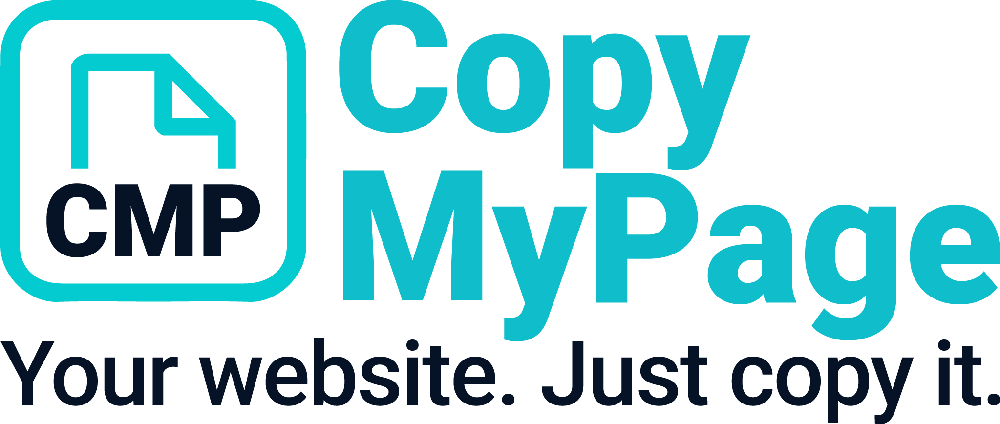

  

## Project Overview

**CopyMyPage** is a platform based on **Joomla** that allows users to **clone** a website that has already been created. During the cloning process, a **token** is generated to ensure that it is a legitimate copy of the original. This process guarantees that the system remains fully **transparent** and **consistent** – even if some websites eventually go offline.

The concept is based on a **snowball system**, where the platform grows with more and more **clones**, but **every step** is transparent and traceable. Every cloned website contains a **token link** in the footer that starts the installation of the **CopyMyPage package**. This keeps each copy of the system connected to the original and ensures regular updates.

The websites are designed to be **performance-oriented**, **SEO-friendly**, and **accessible**, following the principles of **Google Lighthouse**. The **landing page** uses a **one-page design** that includes modules such as **Gallery**, **Hero**, **Team**, **Contact**, and a **Footer**.

**Target Audience:**  
CopyMyPage is aimed at **small businesses**, **self-employed individuals**, and **associations**, such as **carnival clubs** 🎉 or **craft businesses** 🛠️, who need a professional, customizable website quickly, without needing to dive into technical details.

**Cloning Made Easy:**  
Even **web novices** can easily identify with the cloning process – with the motto: "If the local plumber can do it, then I can too" 🪜. The system allows you to quickly clone and customize a professional website. However, each cloned website offers enough **technical and design flexibility** to ensure that it can have a **personal touch**. This is made possible later through an **intuitive admin interface**, which allows easy adjustments of content and design.

**Free, But With Options:**  
The entire project will remain **always free**, with the possibility to make **in-app purchases** for certain **advanced features**. These additional features will be **clearly marked**, so users know when they are accessing paid options. The goal is to keep the platform **ad-free** and offer access to the core features **completely free of charge**.

**Reach and Multilingualism:**  
The reach of the **snowball system** is **far-reaching**. Through **multilingualism** 🇩🇪🇮🇹🇪🇸, not only small businesses and associations in Germany can benefit, but also, for example, a **painter in Italy** or an **association in Spain**.
